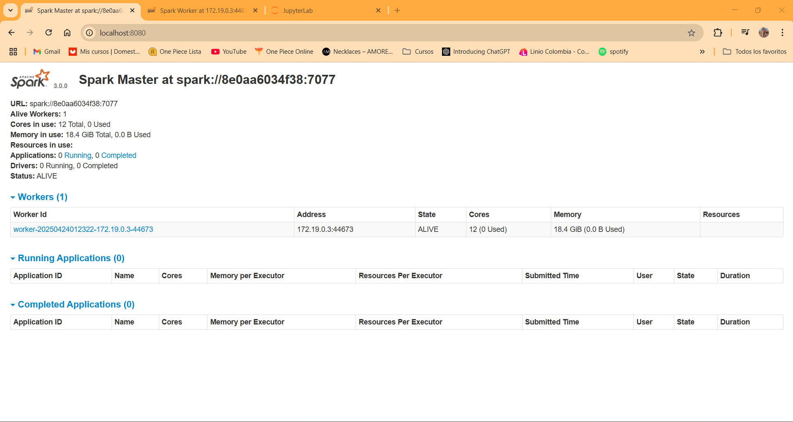
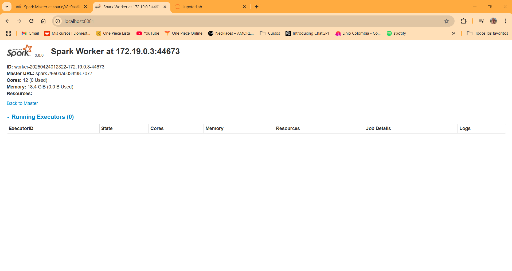
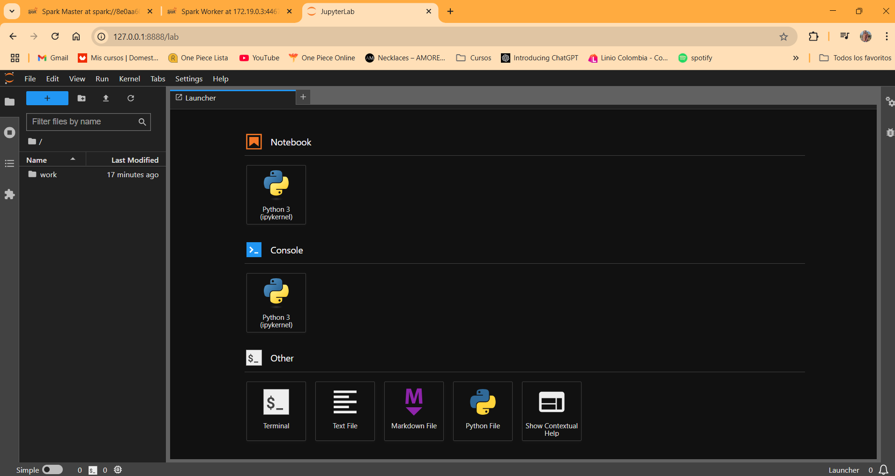
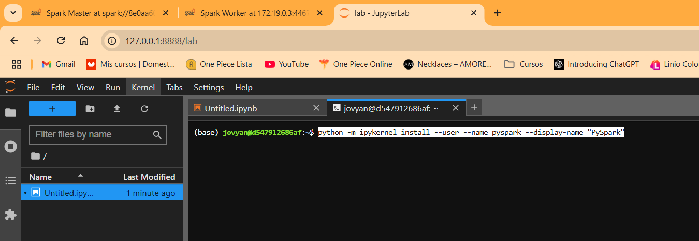

## Documentación técnica – **Punto 8: Integración del Proceso de ETL en Entorno Contenerizado**

Consolidar todo el proceso desarrollado en los puntos anteriores en un entorno ejecutable, que integre:

* La creación del modelo de datos ficticio.
* La ingesta desde fuentes heterogéneas (Excel y SQL Server).
* La orquestación de vistas y zonas de consumo.
* La posibilidad de ejecutarlo y probarlo como si estuviera en producción.

---

### **Propuesta de solución**

Para simular un entorno realista y reproducible, se decide contenerizar el flujo completo usando **Docker Compose** y componentes específicos:

| Componente                 | Propósito                                                                                   |
| -------------------------- | -------------------------------------------------------------------------------------------- |
| **Spark Master**     | Nodo de control que orquesta el clúster de Spark                                            |
| **Spark Worker**     | Nodo que ejecuta tareas asignadas por el master                                              |
| **Jupyter Notebook** | Interfaz web para ejecutar código PySpark, leer/parquet, crear vistas, probar queries, etc. |
| **SQL Server**       | Base de datos ficticia que simula un origen transaccional                                    |

### Estructura de carpetas dentro del repo `s4l`

```lua
s4l/
├── spark_docker/
│   ├── docker-compose.yml  <-- orquesta el entorno
│   ├── master/              <-- contiene Dockerfile y script para Spark Master
│   ├── worker/              <-- contiene Dockerfile y script para Spark Worker
│   └── notebooks/           <-- notebooks accesibles desde Jupyter
├── data_lake/               <-- almacenamiento Parquet simulado por zonas
├── data_source/             <-- archivos como el Excel del punto 6
├── puntos_scripts/          <-- scripts usados en los puntos anteriores
├── utils/                   <-- funciones auxiliares, logger, etc.
└── ...

```

### Ejecución

Ubicados en `sl4/spark_docker` ejecutamos `docker compose --env-file ../.env up --build` y en consecuencia nos levante distintos servicios.

### **Servicios funcionando:**

| Servicio             | Descripción                                                                          | Puerto Local                                      |
| -------------------- | ------------------------------------------------------------------------------------- | ------------------------------------------------- |
| `spark-master`     | Nodo central de coordinación de Spark (UI disponible)                                | `http://localhost:8080`                         |
| `spark-worker`     | Nodo trabajador de Spark que ejecutará las tareas distribuidas                       | `http://localhost:8081`                         |
| `jupyter-notebook` | Entorno de notebooks Jupyter con PySpark preconfigurado conectado al `spark-master` | `http://localhost:8888`(con token)              |
| `sql_server`       | Instancia de Microsoft SQL Server 2019 Developer Edition                              | `localhost:1433`(para conexión DBeaver o JDBC) |

#### spark-master:



#### **spark-worker:**



#### **jupyter-notebook**



##### configurar notebok

Después de desplegado hay que añadir el kernel de pyspark para eso se abre una terminal en jupyter en la instancia y se ejecuta: `python -m ipykernel install --user --name pyspark --display-name "PySpark"`



SQL Server
