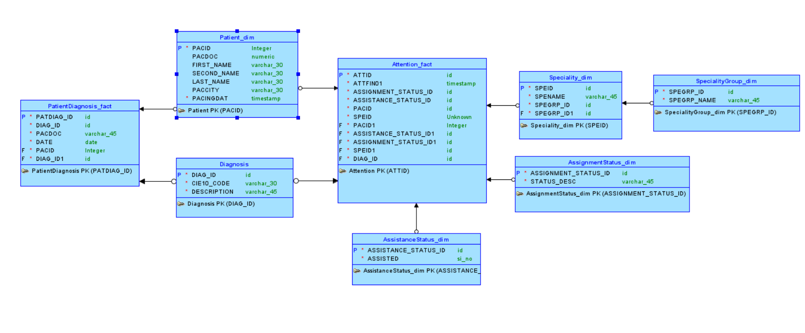
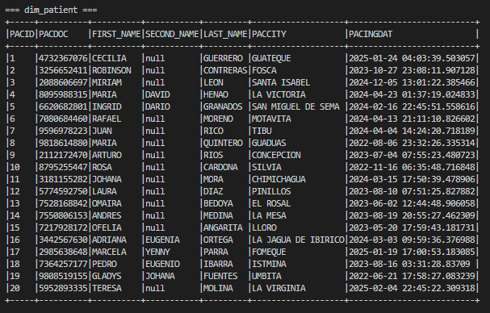
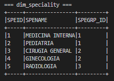
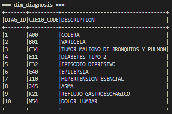
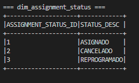
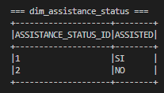
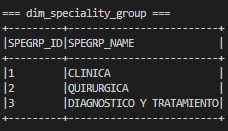
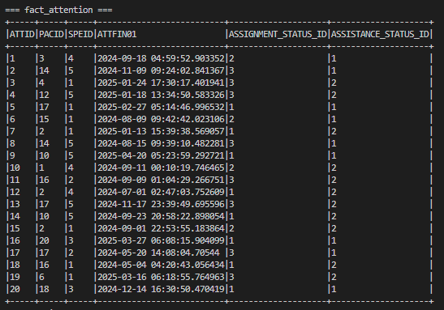
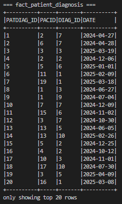

## Punto 1 – Mejora del modelo de datos del ERP

### Modelo original

Tablas actuales del ERP:

* **Patient**
  * `PACID` (PK), `PACDOC`, `PACNAME`, `PACCITY`, `PACINGDAT`
* **Attention**
  * `ATTID` (PK), `ATTFIN01` (fecha), `ATTFIN02` (estado asignación), `ATTFIN03` (asistencia), `ATTFIN04` (FK paciente), `ATTFIN05` (FK especialidad)
* **Speciality**
  * `SPEID` (PK), `SPENAME`, `SPEGRP`

---

### Problemas detectados

1. **Violación de la 1FN y 2FN:**
   * `PACNAME` es una concatenación de nombres → no es atómico.
   * `ATTFIN02` y `ATTFIN03` son valores codificados directamente → deberían normalizarse.
2. **Falta de trazabilidad para diagnósticos:**
   * No existe una relación estructurada entre `Attention` y los diagnósticos (aunque estos existen manualmente en el Excel).
3. **Redundancia y poca claridad semántica:**
   * `SPEGRP` debería ser una FK a una tabla de grupos de especialidad.
   * Estados como "Asignado" y "Asistió" no deberían ser campos codificados directamente.

---

### Modelo propuesto (constelación de hechos)

Se propone un modelo basado en dos hechos principales:

1. **Attention_fact** → Registro de citas médicas
2. **PatientDiagnosis_fact** → Diagnósticos asignados a pacientes por fecha

Ambos comparten dimensiones como `Patient_dim`, `Diagnosis_dim`, `Tiempo`. (La dimensión del tiempo en lo personal no me gusta utilizarla pero no deja de ser una opción que sigue las buenas prácticas).



#### Nuevas tablas propuestas:

1. **Patient (mejorada)**
   * `PACID`, `PACDOC`, `FIRST_NAME`, `SECOND_NAME`, `LAST_NAME`, `PACCITY`, `PACINGDAT`
2. **Speciality**
   * `SPEID`, `SPENAME`, `SPEGRP_ID` (FK)
3. **SpecialityGroup**
   * `SPEGRP_ID`, `SPEGRP_NAME`
4. **Attention**
   * `ATTID`, `ATTFIN01`, `ASSIGNMENT_STATUS_ID` (FK), `ASSISTANCE_STATUS_ID` (FK), `PACID` (FK), `SPEID` (FK)
5. **AssignmentStatus**
   * `ASSIGNMENT_STATUS_ID`, `STATUS_DESC` (Ej: Asignado, Pendiente, Cancelado)
6. **AssistanceStatus**
   * `ASSISTANCE_STATUS_ID`, `ASSISTED` (Ej: SI / NO)
7. **Diagnosis**
   * `DIAG_ID`, `CIE10_CODE`, `DESCRIPTION` (catálogo)
8. **PatientDiagnosis (relacional)**
   * `PATDIAG_ID`, `PACDOC`, `DATE`, `DIAG_ID`

#### Tablas y descripción de campos

##### 1. `dim_Patient`

| Campo       | Tipo        | Descripción                      |
| ----------- | ----------- | --------------------------------- |
| PACID       | Integer     | Identificador único del paciente |
| PACDOC      | Numeric     | Documento de identificación      |
| FIRST_NAME  | Varchar(30) | Primer nombre del paciente        |
| SECOND_NAME | Varchar(30) | Segundo nombre                    |
| LAST_NAME   | Varchar(30) | Apellido                          |
| PACCITY     | Varchar(30) | Ciudad del paciente               |
| PACINGDAT   | Timestamp   | Fecha de ingreso al sistema       |

##### 2. `dim_Diagnosis`

| Campo       | Tipo        | Descripción                         |
| ----------- | ----------- | ------------------------------------ |
| DIAG_ID     | ID          | Identificador único de diagnóstico |
| CIE10_CODE  | Varchar(30) | Código CIE10                        |
| DESCRIPTION | Varchar(45) | Descripción del diagnóstico        |

##### 3. `dim_PatientDiagnosis`

| Campo      | Tipo        | Descripción                                 |
| ---------- | ----------- | -------------------------------------------- |
| PATDIAG_ID | ID          | Identificador único de la fila              |
| PACDOC     | Varchar(45) | Documento del paciente                       |
| PACID      | Integer     | FK a `Patient_dim`                         |
| DIAG_ID    | ID          | FK a `Diagnosis`                           |
| DATE       | Date        | Fecha en la que fue asignado el diagnóstico |

##### 4. `fact_Attention`

| Campo                | Tipo      | Descripción                  |
| -------------------- | --------- | ----------------------------- |
| ATTID                | ID        | Identificador de cita         |
| PACID                | Integer   | FK a paciente                 |
| SPEID                | ID        | FK a especialidad             |
| ATTFIN01             | Timestamp | Fecha de la cita              |
| ASSIGNMENT_STATUS_ID | ID        | FK a `AssignmentStatus_dim` |
| ASSISTANCE_STATUS_ID | ID        | FK a `AssistanceStatus_dim` |

##### 5. `dim_Speciality`

| Campo     | Tipo        | Descripción                            |
| --------- | ----------- | --------------------------------------- |
| SPEID     | ID          | Identificador único de la especialidad |
| SPENAME   | Varchar(45) | Nombre de la especialidad               |
| SPEGRP_ID | ID          | FK a `SpecialityGroup_dim`            |

##### 6. `dim_SpecialityGroup`

| Campo       | Tipo        | Descripción                             |
| ----------- | ----------- | ---------------------------------------- |
| SPEGRP_ID   | ID          | Identificador del grupo de especialidad  |
| SPEGRP_NAME | Varchar(45) | Nombre del grupo (Clínica, Quirúrgica) |

##### 7. `fact_AssignmentStatus`

| Campo                | Tipo        | Descripción                             |
| -------------------- | ----------- | ---------------------------------------- |
| ASSIGNMENT_STATUS_ID | ID          | Identificador de estado de asignación   |
| STATUS_DESC          | Varchar(45) | Descripción del estado (Asignado, etc.) |

##### 8. `AssistanceStatus_dim`

| Campo                | Tipo        | Descripción                           |
| -------------------- | ----------- | -------------------------------------- |
| ASSISTANCE_STATUS_ID | ID          | Identificador del estado de asistencia |
| ASSISTED             | ENUM(SI/NO) | Valor binario de asistencia            |

#### Relaciones

* `PatientDiagnosis_fact.PACID` → `Patient_dim.PACID`
* `PatientDiagnosis_fact.DIAG_ID` → `Diagnosis.DIAG_ID`
* `Attention_fact.PACID` → `Patient_dim.PACID`
* `Attention_fact.SPEID` → `Speciality_dim.SPEID`
* `Speciality_dim.SPEGRP_ID` → `SpecialityGroup_dim.SPEGRP_ID`
* `Attention_fact.ASSIGNMENT_STATUS_ID` → `AssignmentStatus_dim`
* `Attention_fact.ASSISTANCE_STATUS_ID` → `AssistanceStatus_dim`

#### Beneficios de esta mejora

* **Separación de nombres:** Esta mejora es subjetiva, dependerá del objetivo del análisis, sin embargo da un cumplimiento más purista de la 1FN
* **Cumple 3FN** : cada atributo depende exclusivamente de su PK y no de campos derivados.
* **Facilita joins y transformación de datos** en pipelines ETL.
* **Evita hardcoding** de valores categóricos y permite internacionalización o multi-etapas.
* **Permite integrar fácilmente el Excel de diagnósticos** en una tabla estructurada (`PatientDiagnosis_fact`).

---

## Punto 2 – Organización de datos en un Data Lake (Bronze, Silver, Gold)

### Propuesta general

Suponiendo que parte de la data ingestada del cliente proviene tanto del ERP como de archivos externos (como el Excel de diagnósticos), se plantea una organización del Data Lake basada en el enfoque de **medallion architecture**, que divide el almacenamiento en tres zonas jerárquicas: `bronze`, `silver` y `gold`. Esta estructura permite un flujo claro de ingesta, limpieza y consumo analítico, garantizando trazabilidad, escalabilidad y eficiencia en el procesamiento.

### Estructura sugerida de carpetas

```bash
data_lake/
├── bronze/
│   ├── patient/
│   ├── attention/
│   ├── speciality/
│   └── diagnosticos/       # archivo de Excel con los diagnósticos
├── silver/
│   ├── dim_patient/
│   ├── dim_speciality/
│   ├── dim_speciality_group/
│   ├── dim_diagnosis/
│   ├── dim_assignment_status/
│   ├── dim_assistance_status/
│   ├── fact_attention/
│   └── fact_patient_diagnosis/
└── gold/
    ├── indicadores_atenciones/    # cantidad por especialidad/paciente
    ├── tiempo_promedio_atencion/
    └── evolucion_diagnosticos/
```

### **Zona Bronze – Ingesta cruda**

Esta capa almacena los  **datos originales extraídos directamente desde las fuentes** , sin más transformación que una posible conversión de formato (por ejemplo, de `.xlsx` a `.parquet`). Aquí pueden almacenarse archivos planos, JSONs, dumps SQL o cualquier otra forma original de los datos. El objetivo principal es preservar la fidelidad de la fuente para fines de trazabilidad, auditoría y recuperación.

| Objeto / Dataset         | Descripción                                      |
| ------------------------ | ------------------------------------------------- |
| `bronze/patient/`      | Dump crudo de la tabla `Patient`del ERP         |
| `bronze/attention/`    | Dump crudo de `Attention`                       |
| `bronze/speciality/`   | Dump crudo de `Speciality`                      |
| `bronze/diagnosticos/` | Archivo Excel sin transformar, tal como se recibe |

*Nota:* en esta capa los datos pueden estar en formatos estructurados (ej. CSV, Parquet) o semiestructurados (ej. JSON, Excel). No es obligatorio que sean "tablas"; lo importante es que representen una **copia fiel y sin procesar** de la fuente original.

### **Zona Silver – Modelo estructurado (modelo estrella)**

Esta zona contiene datos  **limpios, validados y normalizados.** Aquí se implementa el  **modelo dimensional tipo estrella** , compuesto por tablas de hechos (`fact_`) y dimensiones (`dim_`), con claves sustitutas y relaciones estandarizadas. Esta es la capa ideal para implementar el modelo estrella, ya que los datos están limpios y listos para ser reutilizados en múltiples indicadores analíticos sin pérdida de granularidad.

| Tabla                       | Descripción                                          |
| --------------------------- | ----------------------------------------------------- |
| `dim_patient/`            | Pacientes con nombres separados y claves normalizadas |
| `dim_speciality/`         | Especialidades                                        |
| `dim_speciality_group/`   | Grupos de especialidad (Clínica, Quirúrgica)        |
| `dim_diagnosis/`          | Catálogo CIE10                                       |
| `dim_assignment_status/`  | Estados de asignación                                |
| `dim_assistance_status/`  | Asistencias (Sí / No)                                |
| `fact_attention/`         | Citas médicas                                        |
| `fact_patient_diagnosis/` | Diagnósticos por paciente y fecha                    |

### **Zona Gold – Indicadores y vistas analíticas**

Contiene  **vistas agregadas** , cálculos y métricas que responden directamente a necesidades del negocio o reporting.Acá debe ir porqué esta zona está pensada para el consumo por analistas, dashboards, PowerBI, o APIs. Los datos están optimizados para lectura y toma de decisiones.

| Vista                         | Descripción                                     |
| ----------------------------- | ------------------------------------------------ |
| `indicadores_atenciones/`   | Citas por especialidad y paciente                |
| `tiempo_promedio_atencion/` | Tiempo promedio entre citas de un mismo paciente |
| `evolucion_diagnosticos/`   | Diagnósticos por mes / evolución temporal      |

### Justificación de la distribución

* El modelo estrella en Silver permite mantener la granularidad y evitar duplicidad de cálculos.
* La separación en zonas facilita el control de calidad y la trazabilidad.
* El paso de Silver a Gold permite generar indicadores optimizados sin afectar los datos de base.

## Punto 3 – Construcción del modelo ERP en PySpark

Este punto tiene como objetivo construir un modelo de datos analítico a partir de la información simulada de un ERP del sector salud. Para ello, se implementó un esquema tipo constelación con múltiples tablas de dimensiones y dos hechos principales.

Se decidió construir las estructuras utilizando PySpark en modo local, modelando las tablas en memoria mediante `StructType` y `Row`, con generación de datos ficticios usando la librería `faker`. Por motivos de practicidad y enfoque en el diseño del modelo de datos, los datasets se construyeron de forma virtual, es decir:

* Los datos se simularon en tiempo de ejecución para poblar las tablas y validar las relaciones.

El punto fue resuelto mediante el script `puntos_scripts/punto_3.py`.

### Estructura del script

1. **Importación de módulos y configuración de path**
   * Se ajusta el `sys.path` para permitir importar el módulo `etl` desde el script, sin necesidad de ejecutarlo como paquete.
   * Se importan todas las funciones de generación desde `populate_model_erp.py`.
2. **Inicialización de la sesión de Spark**
   * Se crea una sesión local con nombre `erp_model_orchestrator` mediante `SparkSession.builder`.
3. **Generación de dimensiones**
   * `dim_patient`: información básica de pacientes
   * `dim_speciality`: especialidades médicas
   * `dim_speciality_group`: grupo al que pertenece cada especialidad
   * `dim_diagnosis`: catálogo de diagnósticos CIE10
   * `dim_assignment_status`: estados de asignación de citas
   * `dim_assistance_status`: registro binario de asistencia a la cita
4. **Generación de hechos**
   * `fact_attention`: información de citas por paciente y especialidad
   * `fact_patient_diagnosis`: asignación de diagnósticos a pacientes
5. **Visualización**
   * Se utiliza `.show(truncate=False)` sobre cada DataFrame para imprimir su contenido completo en consola y verificar la estructura generada.
6. **Persistencia en disco**
   * Todos los DataFrames son almacenados en formato `parquet` dentro de la carpeta `data_lake/silver/`.
   * Se utiliza el modo `overwrite` para asegurar que se reemplacen versiones anteriores sin conflicto.
7. **Finalización**
   * Se cierra la sesión de Spark con `spark.stop()` para liberar recursos del entorno.

### Ejecución

Para ejecutar este script desde WSL o terminal:
`python puntos_scripts/punto_3.py`

### Output:



  

      

  


**Nota**: La solución fue ejecutada localmente con PySpark, aunque podría escalar fácilmente a un clúster real Spark standalone o Databricks, ya que los scripts están desacoplados del entorno de ejecución.
