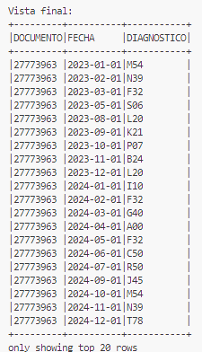

## Punto 1 – Mejora del modelo de datos del ERP

### Modelo original

Tablas actuales del ERP:

* **Patient**
  * `PACID` (PK), `PACDOC`, `PACNAME`, `PACCITY`, `PACINGDAT`
* **Attention**
  * `ATTID` (PK), `ATTFIN01` (fecha), `ATTFIN02` (estado asignación), `ATTFIN03` (asistencia), `ATTFIN04` (FK paciente), `ATTFIN05` (FK especialidad)
* **Speciality**
  * `SPEID` (PK), `SPENAME`, `SPEGRP`

---

### Problemas detectados

1. **Violación de la 1FN y 2FN:**
   * `PACNAME` es una concatenación de nombres → no es atómico.
   * `ATTFIN02` y `ATTFIN03` son valores codificados directamente → deberían normalizarse.
2. **Falta de trazabilidad para diagnósticos:**
   * No existe una relación estructurada entre `Attention` y los diagnósticos (aunque estos existen manualmente en el Excel).
3. **Redundancia y poca claridad semántica:**
   * `SPEGRP` debería ser una FK a una tabla de grupos de especialidad.
   * Estados como "Asignado" y "Asistió" no deberían ser campos codificados directamente.

---

### Modelo propuesto (constelación de hechos)

Se propone un modelo basado en dos hechos principales:

1. **Attention_fact** → Registro de citas médicas
2. **PatientDiagnosis_fact** → Diagnósticos asignados a pacientes por fecha

Ambos comparten dimensiones como `Patient_dim`, `Diagnosis_dim`, `Tiempo`. (La dimensión del tiempo en lo personal no me gusta utilizarla pero no deja de ser una opción que sigue las buenas prácticas).

#### Esquema del modelo:


#### Nuevas tablas propuestas:

1. **Patient (mejorada)**
   * `PACID`, `PACDOC`, `FIRST_NAME`, `SECOND_NAME`, `LAST_NAME`, `PACCITY`, `PACINGDAT`
2. **Speciality**
   * `SPEID`, `SPENAME`, `SPEGRP_ID` (FK)
3. **SpecialityGroup**
   * `SPEGRP_ID`, `SPEGRP_NAME`
4. **Attention**
   * `ATTID`, `ATTFIN01`, `ASSIGNMENT_STATUS_ID` (FK), `ASSISTANCE_STATUS_ID` (FK), `PACID` (FK), `SPEID` (FK)
5. **AssignmentStatus**
   * `ASSIGNMENT_STATUS_ID`, `STATUS_DESC` (Ej: Asignado, Pendiente, Cancelado)
6. **AssistanceStatus**
   * `ASSISTANCE_STATUS_ID`, `ASSISTED` (Ej: SI / NO)
7. **Diagnosis**
   * `DIAG_ID`, `CIE10_CODE`, `DESCRIPTION` (catálogo)
8. **PatientDiagnosis (relacional)**
   * `PATDIAG_ID`, `PACDOC`, `DATE`, `DIAG_ID`

#### Tablas y descripción de campos

##### 1. `dim_Patient`

| Campo       | Tipo        | Descripción                      |
| ----------- | ----------- | --------------------------------- |
| PACID       | Integer     | Identificador único del paciente |
| PACDOC      | Numeric     | Documento de identificación      |
| FIRST_NAME  | Varchar(30) | Primer nombre del paciente        |
| SECOND_NAME | Varchar(30) | Segundo nombre                    |
| LAST_NAME   | Varchar(30) | Apellido                          |
| PACCITY     | Varchar(30) | Ciudad del paciente               |
| PACINGDAT   | Timestamp   | Fecha de ingreso al sistema       |

##### 2. `dim_Diagnosis`

| Campo       | Tipo        | Descripción                         |
| ----------- | ----------- | ------------------------------------ |
| DIAG_ID     | ID          | Identificador único de diagnóstico |
| CIE10_CODE  | Varchar(30) | Código CIE10                        |
| DESCRIPTION | Varchar(45) | Descripción del diagnóstico        |

##### 3. `dim_PatientDiagnosis`

| Campo      | Tipo        | Descripción                                 |
| ---------- | ----------- | -------------------------------------------- |
| PATDIAG_ID | ID          | Identificador único de la fila              |
| PACDOC     | Varchar(45) | Documento del paciente                       |
| PACID      | Integer     | FK a `Patient_dim`                         |
| DIAG_ID    | ID          | FK a `Diagnosis`                           |
| DATE       | Date        | Fecha en la que fue asignado el diagnóstico |

##### 4. `fact_Attention`

| Campo                | Tipo      | Descripción                  |
| -------------------- | --------- | ----------------------------- |
| ATTID                | ID        | Identificador de cita         |
| PACID                | Integer   | FK a paciente                 |
| SPEID                | ID        | FK a especialidad             |
| ATTFIN01             | Timestamp | Fecha de la cita              |
| ASSIGNMENT_STATUS_ID | ID        | FK a `AssignmentStatus_dim` |
| ASSISTANCE_STATUS_ID | ID        | FK a `AssistanceStatus_dim` |

##### 5. `dim_Speciality`

| Campo     | Tipo        | Descripción                            |
| --------- | ----------- | --------------------------------------- |
| SPEID     | ID          | Identificador único de la especialidad |
| SPENAME   | Varchar(45) | Nombre de la especialidad               |
| SPEGRP_ID | ID          | FK a `SpecialityGroup_dim`            |

##### 6. `dim_SpecialityGroup`

| Campo       | Tipo        | Descripción                             |
| ----------- | ----------- | ---------------------------------------- |
| SPEGRP_ID   | ID          | Identificador del grupo de especialidad  |
| SPEGRP_NAME | Varchar(45) | Nombre del grupo (Clínica, Quirúrgica) |

##### 7. `fact_AssignmentStatus`

| Campo                | Tipo        | Descripción                             |
| -------------------- | ----------- | ---------------------------------------- |
| ASSIGNMENT_STATUS_ID | ID          | Identificador de estado de asignación   |
| STATUS_DESC          | Varchar(45) | Descripción del estado (Asignado, etc.) |

##### 8. `AssistanceStatus_dim`

| Campo                | Tipo        | Descripción                           |
| -------------------- | ----------- | -------------------------------------- |
| ASSISTANCE_STATUS_ID | ID          | Identificador del estado de asistencia |
| ASSISTED             | ENUM(SI/NO) | Valor binario de asistencia            |

#### Relaciones

* `PatientDiagnosis_fact.PACID` → `Patient_dim.PACID`
* `PatientDiagnosis_fact.DIAG_ID` → `Diagnosis.DIAG_ID`
* `Attention_fact.PACID` → `Patient_dim.PACID`
* `Attention_fact.SPEID` → `Speciality_dim.SPEID`
* `Speciality_dim.SPEGRP_ID` → `SpecialityGroup_dim.SPEGRP_ID`
* `Attention_fact.ASSIGNMENT_STATUS_ID` → `AssignmentStatus_dim`
* `Attention_fact.ASSISTANCE_STATUS_ID` → `AssistanceStatus_dim`

#### Beneficios de esta mejora

* **Separación de nombres:** Esta mejora es subjetiva, dependerá del objetivo del análisis, sin embargo da un cumplimiento más purista de la 1FN
* **Cumple 3FN** : cada atributo depende exclusivamente de su PK y no de campos derivados.
* **Facilita joins y transformación de datos** en pipelines ETL.
* **Evita hardcoding** de valores categóricos y permite internacionalización o multi-etapas.
* **Permite integrar fácilmente el Excel de diagnósticos** en una tabla estructurada (`PatientDiagnosis_fact`).

---

## Punto 2 – Organización de datos en un Data Lake (Bronze, Silver, Gold)

### Propuesta general

Suponiendo que parte de la data ingestada del cliente proviene tanto del ERP como de archivos externos (como el Excel de diagnósticos), se plantea una organización del Data Lake basada en el enfoque de **medallion architecture**, que divide el almacenamiento en tres zonas jerárquicas: `bronze`, `silver` y `gold`. Esta estructura permite un flujo claro de ingesta, limpieza y consumo analítico, garantizando trazabilidad, escalabilidad y eficiencia en el procesamiento.

### Estructura sugerida de carpetas

```bash
data_lake/
├── bronze/
│   ├── patient/
│   ├── attention/
│   ├── speciality/
│   └── diagnosticos/       # archivo de Excel con los diagnósticos
├── silver/
│   ├── dim_patient/
│   ├── dim_speciality/
│   ├── dim_speciality_group/
│   ├── dim_diagnosis/
│   ├── dim_assignment_status/
│   ├── dim_assistance_status/
│   ├── fact_attention/
│   └── fact_patient_diagnosis/
└── gold/
    ├── indicadores_atenciones/    # cantidad por especialidad/paciente
    ├── tiempo_promedio_atencion/
    └── evolucion_diagnosticos/
```

### **Zona Bronze – Ingesta cruda**

Esta capa almacena los  **datos originales extraídos directamente desde las fuentes** , sin más transformación que una posible conversión de formato (por ejemplo, de `.xlsx` a `.parquet`). Aquí pueden almacenarse archivos planos, JSONs, dumps SQL o cualquier otra forma original de los datos. El objetivo principal es preservar la fidelidad de la fuente para fines de trazabilidad, auditoría y recuperación.

| Objeto / Dataset         | Descripción                                      |
| ------------------------ | ------------------------------------------------- |
| `bronze/patient/`      | Dump crudo de la tabla `Patient`del ERP         |
| `bronze/attention/`    | Dump crudo de `Attention`                       |
| `bronze/speciality/`   | Dump crudo de `Speciality`                      |
| `bronze/diagnosticos/` | Archivo Excel sin transformar, tal como se recibe |

*Nota:* en esta capa los datos pueden estar en formatos estructurados (ej. CSV, Parquet) o semiestructurados (ej. JSON, Excel). No es obligatorio que sean "tablas"; lo importante es que representen una **copia fiel y sin procesar** de la fuente original.

### **Zona Silver – Modelo estructurado (modelo estrella)**

Esta zona contiene datos  **limpios, validados y normalizados.** Aquí se implementa el  **modelo dimensional tipo estrella** , compuesto por tablas de hechos (`fact_`) y dimensiones (`dim_`), con claves sustitutas y relaciones estandarizadas. Esta es la capa ideal para implementar el modelo estrella, ya que los datos están limpios y listos para ser reutilizados en múltiples indicadores analíticos sin pérdida de granularidad.

| Tabla                       | Descripción                                          |
| --------------------------- | ----------------------------------------------------- |
| `dim_patient/`            | Pacientes con nombres separados y claves normalizadas |
| `dim_speciality/`         | Especialidades                                        |
| `dim_speciality_group/`   | Grupos de especialidad (Clínica, Quirúrgica)        |
| `dim_diagnosis/`          | Catálogo CIE10                                       |
| `dim_assignment_status/`  | Estados de asignación                                |
| `dim_assistance_status/`  | Asistencias (Sí / No)                                |
| `fact_attention/`         | Citas médicas                                        |
| `fact_patient_diagnosis/` | Diagnósticos por paciente y fecha                    |

### **Zona Gold – Indicadores y vistas analíticas**

Contiene  **vistas agregadas** , cálculos y métricas que responden directamente a necesidades del negocio o reporting.Acá debe ir porqué esta zona está pensada para el consumo por analistas, dashboards, PowerBI, o APIs. Los datos están optimizados para lectura y toma de decisiones.

| Vista                         | Descripción                                     |
| ----------------------------- | ------------------------------------------------ |
| `indicadores_atenciones/`   | Citas por especialidad y paciente                |
| `tiempo_promedio_atencion/` | Tiempo promedio entre citas de un mismo paciente |
| `evolucion_diagnosticos/`   | Diagnósticos por mes / evolución temporal      |

### Justificación de la distribución

* El modelo estrella en Silver permite mantener la granularidad y evitar duplicidad de cálculos.
* La separación en zonas facilita el control de calidad y la trazabilidad.
* El paso de Silver a Gold permite generar indicadores optimizados sin afectar los datos de base.

## Punto 3 – Construcción del modelo ERP en PySpark

Este punto tiene como objetivo construir un modelo de datos analítico a partir de la información simulada de un ERP del sector salud. Para ello, se implementó un esquema tipo constelación con múltiples tablas de dimensiones y dos hechos principales.

Se decidió construir las estructuras utilizando PySpark en modo local, modelando las tablas en memoria mediante `StructType` y `Row`, con generación de datos ficticios usando la librería `faker`. Por motivos de practicidad y enfoque en el diseño del modelo de datos, los datasets se construyeron de forma virtual, es decir:

* Los datos se simularon en tiempo de ejecución para poblar las tablas y validar las relaciones.

El punto fue resuelto mediante el script `puntos_scripts/punto_3.py`.

### Estructura del script

1. **Importación de módulos y configuración de path**
   * Se ajusta el `sys.path` para permitir importar el módulo `etl` desde el script, sin necesidad de ejecutarlo como paquete.
   * Se importan todas las funciones de generación desde `populate_model_erp.py`.
2. **Inicialización de la sesión de Spark**
   * Se crea una sesión local con nombre `erp_model_orchestrator` mediante `SparkSession.builder`.
3. **Generación de dimensiones**
   * `dim_patient`: información básica de pacientes
   * `dim_speciality`: especialidades médicas
   * `dim_speciality_group`: grupo al que pertenece cada especialidad
   * `dim_diagnosis`: catálogo de diagnósticos CIE10
   * `dim_assignment_status`: estados de asignación de citas
   * `dim_assistance_status`: registro binario de asistencia a la cita
4. **Generación de hechos**
   * `fact_attention`: información de citas por paciente y especialidad
   * `fact_patient_diagnosis`: asignación de diagnósticos a pacientes
5. **Visualización**
   * Se utiliza `.show(truncate=False)` sobre cada DataFrame para imprimir su contenido completo en consola y verificar la estructura generada.
6. **Persistencia en disco**
   * Todos los DataFrames son almacenados en formato `parquet` dentro de la carpeta `data_lake/silver/`.
   * Se utiliza el modo `overwrite` para asegurar que se reemplacen versiones anteriores sin conflicto.
7. **Finalización**
   * Se cierra la sesión de Spark con `spark.stop()` para liberar recursos del entorno.

### Ejecución

Para ejecutar este script desde WSL o terminal:
`python puntos_scripts/punto_3.py`

### Output:

#### Dimensión: Patient


#### Dimensión: Diagnosis


#### Dimensión: Assistance Status


#### Dimensión: Assignment Status


#### Dimensión: Speciality


#### Dimensión: Speciality Group


#### Hechos: Attention


#### Hechos: Patient Diagnosis


### **Nota: La solución fue ejecutada localmente con PySpark, aunque podría escalar fácilmente a un clúster real Spark standalone o Databricks, ya que los scripts están desacoplados del entorno de ejecución.**

## Punto 4 - Consolidación de información del ERP en una vista lógica

Para consolidar la información proveniente del ERP en una única vista lógica, se partió del modelo propuesto en el  **punto 1** , el cual normaliza y separa adecuadamente las entidades clave del sistema. Este modelo facilita la construcción de consultas analíticas eficientes mediante el uso de joins bien definidos entre tablas de hechos y dimensiones.

En este caso, se creó una vista que resume los datos relacionados con las atenciones médicas de los pacientes, permitiendo tener una única tabla enriquecida que integra los siguientes elementos: identificación del paciente, fecha de atención, especialidad médica asignada, grupo de especialidad, estado de asignación y asistencia.

### Estrategia técnica

Se implementaron dos formas equivalentes para construir esta vista:

1. **Usando Spark SQL** : registrando temporalmente cada tabla como una vista y luego ejecutando un query desde un archivo `.sql`.
2. **Usando la API de DataFrame de PySpark** : encadenando los joins directamente sobre los DataFrames cargados desde Parquet.

Ambos enfoques leen los datos desde la **zona silver** del Data Lake y consolidan la información en una única vista que es luego almacenada en la  **zona gold** , bajo el nombre `atencion_detalle`.

Esta implementación permite un análisis ágil y limpio sobre los registros de atención médica sin pérdida de trazabilidad.

### Ejecución

`python puntos_scripts/punto_4.py --mode sql/df`

### Contenido de la vista `atencion_detalle`

| Campo                 | Fuente                             |
| --------------------- | ---------------------------------- |
| `ATTID`             | `fact_attention`                 |
| `FECHA_ATENCION`    | `fact_attention.ATTFIN01`        |
| `PACID`             | `fact_attention`/`dim_patient` |
| `PACDOC`            | `dim_patient`                    |
| `FIRST_NAME`        | `dim_patient`                    |
| `SECOND_NAME`       | `dim_patient`                    |
| `LAST_NAME`         | `dim_patient`                    |
| `PACCITY`           | `dim_patient`                    |
| `PACINGDAT`         | `dim_patient`                    |
| `SPENAME`           | `dim_speciality`                 |
| `SPEGRP_NAME`       | `dim_speciality_group`           |
| `ESTADO_ASIGNACION` | `dim_assignment_status`          |
| `ASISTENCIA`        | `dim_assistance_status`          |

Esta vista representa una fuente rica y estandarizada para análisis posteriores, dashboards, reportes, o integración con sistemas externos.

### Modos de construcción de la vista

#### 1. Usando Spark SQL

Las tablas fueron registradas como vistas temporales (`createOrReplaceTempView`) y luego se ejecutó el siguiente query, definido en el archivo `queries/atencion_detalle.sql`:

```sql
SELECT
    f.ATTID,
    f.ATTFIN01 AS FECHA_ATENCION,
    p.PACID,
    p.PACDOC,
    p.FIRST_NAME,
    p.SECOND_NAME,
    p.LAST_NAME,
    p.PACCITY,
    p.PACINGDAT,
    s.SPENAME,
    g.SPEGRP_NAME,
    a.STATUS_DESC AS ESTADO_ASIGNACION,
    ass.ASSISTED AS ASISTENCIA
FROM 
    fact_attention f
JOIN 
    dim_patient p 
    ON f.PACID = p.PACID
JOIN 
    dim_speciality s 
    ON f.SPEID = s.SPEID
JOIN 
    dim_speciality_group g 
    ON s.SPEGRP_ID = g.SPEGRP_ID
JOIN 
    dim_assignment_status a 
    ON f.ASSIGNMENT_STATUS_ID = a.ASSIGNMENT_STATUS_ID
JOIN 
    dim_assistance_status ass 
    ON f.ASSISTANCE_STATUS_ID = ass.ASSISTANCE_STATUS_ID;
```

#### 2. Usando PySpark DataFrame API

Como alternativa, se construyó la misma vista directamente con la API de DataFrames, encadenando los joins entre DataFrames previamente cargados:

```python
df = (
    dfs["fact_attention"].alias("f")
    .join(dfs["dim_patient"].alias("p"), "PACID")
    .join(dfs["dim_speciality"].alias("s"), "SPEID")
    .join(dfs["dim_speciality_group"].alias("g"), col("s.SPEGRP_ID") == col("g.SPEGRP_ID"))
    .join(dfs["dim_assignment_status"].alias("a"), col("f.ASSIGNMENT_STATUS_ID") == col("a.ASSIGNMENT_STATUS_ID"))
    .join(dfs["dim_assistance_status"].alias("ass"), col("f.ASSISTANCE_STATUS_ID") == col("ass.ASSISTANCE_STATUS_ID"))
    .select(
        col("f.ATTID"),
        col("f.ATTFIN01").alias("FECHA_ATENCION"),
        col("p.PACID"),
        col("p.PACDOC"),
        col("p.FIRST_NAME"),
        col("p.SECOND_NAME"),
        col("p.LAST_NAME"),
        col("p.PACCITY"),
        col("p.PACINGDAT"),
        col("s.SPENAME"),
        col("g.SPEGRP_NAME"),
        col("a.STATUS_DESC").alias("ESTADO_ASIGNACION"),
        col("ass.ASSISTED").alias("ASISTENCIA")
    )
)

```

Este método ofrece mayor control programático y es ideal cuando la lógica se construye dinámicamente dentro de pipelines PySpark.

### Persistencia del resultado

Independientemente del modo utilizado (SQL o DataFrame), la vista resultante fue persistida en la  **zona `gold` del Data Lake** , bajo el nombre `atencion_detalle`, en formato  **Parquet** . Esto garantiza eficiencia en el acceso, compatibilidad con herramientas analíticas como Power BI o Tableau, y soporte nativo para compresión y particionamiento, características clave en entornos de analítica moderna con grandes volúmenes de datos. `data_lake/gold/atencion_detalle/`

### Output en la terminal


## Punto 5 – Llave natural de la vista `atencion_detalle`

En el contexto de un modelo mejorado del ERP, se construyó una vista lógica consolidada llamada `atencion_detalle`, la cual reúne datos de pacientes, especialidades y atenciones médicas.

Si eliminamos las llaves técnicas (`ATTID`, `PACID`, `SPEID`) de esta vista, es necesario identificar qué combinación de campos permite distinguir de forma única cada registro. En este caso, se propone como **llave natural** la combinación:

`(PACDOC, FECHA_ATENCION)`

### Ejecución

`❯ python puntos_scripts/punto_5.py --mode sql`

### Justificación

* **PACDOC** representa el documento de identidad del paciente, por tanto, es único por persona.
* **FECHA_ATENCION** corresponde al momento exacto en que se registró la atención médica.
* En la práctica, es  **altamente improbable que un mismo paciente tenga dos citas distintas registradas con el mismo timestamp exacto** , lo cual refuerza la validez de esta combinación como clave natural.
* Esta selección fue verificada mediante una consulta agregada en Spark SQL sobre la vista. El resultado no arrojó duplicados, confirmando la unicidad.

### Consulta utilizada para validación:

```sql
SELECT
    PACDOC,
    FECHA_ATENCION,
    COUNT() AS conteo
FROM atencion_detalle
GROUP BY PACDOC, FECHA_ATENCION
HAVING COUNT() > 1
```

La consulta anterior se ejecutó correctamente y retornó un conjunto vacío, lo que garantiza que no hay colisiones sobre la combinación `PACDOC + FECHA_ATENCION`.

### Output en la terminal


## Punto 6 – Transformación del archivo de diagnósticos en Excel

El objetivo de este punto es convertir un archivo de Excel que contiene diagnósticos registrados por mes en una tabla plana con el siguiente esquema: `DOCUMENTO`, `FECHA`, `DIAGNOSTICO`.

### Descripción del archivo de origen

El archivo `fichas_diagnostico_ficticias.xlsx` contiene una columna de identificación del paciente (`DOCUMENTO`) y múltiples columnas con nombres como "ENERO 2023", "FEBRERO 2023", etc., cada una representando un diagnóstico asociado al mes respectivo. El formato de las fechas es textual (`MMMM YYYY`) y no es compatible directamente con funciones de fecha.

### Solución implementada

Se desarrolló un script en PySpark que:

1. **Carga el archivo Excel** utilizando el paquete `com.crealytics:spark-excel`, lo que permite manipular datos tabulares desde hojas de cálculo directamente en Spark.
2. **Aplica una transformación tipo "melt"** (similar a la función `melt()` de pandas) que pivota las columnas de meses hacia abajo, generando una estructura de tres columnas: `DOCUMENTO`, `MES_ANO` y `DIAGNOSTICO`.
3. **Normaliza las fechas** :

* Se separa el texto del campo `MES_ANO` en dos partes (`mes`, `año`).
* Se utiliza un diccionario (`MONTH_MAP`) para traducir el nombre del mes a su número equivalente.
* Se construye una fecha con el formato `"01/MM/YYYY"` y se convierte a tipo fecha (`date`) con `to_date`.

1. **Filtra los registros inválidos** , eliminando aquellos sin diagnóstico.
2. **Guarda el resultado transformado** en formato Parquet en la capa `gold` del data lake:

   `data_lake/gold/diagnosticos_transformados`.

### Output en la terminal:

La tabla final generada tiene la siguiente estructura:



## Punto 7 ‒ Preguntas generales sobre el uso de Databricks y PySpark

---

### a. Separación de **dev / test / prod** en Unity Catalog con zonas **bronze – silver – gold**

Para estructurar adecuadamente los entornos de desarrollo, pruebas y producción dentro de Databricks utilizando Unity Catalog, se propone una arquitectura lógica que garantice gobernanza, trazabilidad y eficiencia en costos, siguiendo el modelo de zonas  **bronze – silver – gold** .

**1. Uso de un único workspace (Unity Catalog)**

* Se opta por un único workspace compartido entre los tres entornos. Esta decisión permite minimizar costos de infraestructura al evitar la duplicación de instancias de control y facilita la administración centralizada de recursos, clústeres y políticas de acceso.
* Sin embargo si el presupuesto es optimo una práctica más segura sería utilizar un work space por ambiente de desarrollo. Serían tres workspaces para dev, staging y production de tal forma que el CI/CD se haga de forma mas robusta.

**2. Separación por catálogos y external locations**

Se crean tres **catálogos** independientes dentro del mismo Unity Catalog:

* `dev`: para desarrollo local y pruebas exploratorias.
* `test`: para staging e integración antes de producción.
* `prod`: entorno final, gobernado y estable.

Cada catálogo se vincula a una **External Location** distinta en el almacenamiento cloud (por ejemplo, en Azure Data Lake o S3), apuntando a una ruta como:

* `abfss://datalake@storageaccount.dfs.core.windows.net/unity/dev/`
* `abfss://datalake@storageaccount.dfs.core.windows.net/unity/test/`
* `abfss://datalake@storageaccount.dfs.core.windows.net/unity/prod/`

Esta separación garantiza  **aislamiento físico de los datos** , además del lógico, y facilita la gestión de permisos por entorno.

**3. Organización por esquemas medallion**

En cada uno de los catálogos (`dev`, `test`, `prod`), se definen los esquemas:

* `bronze`: para datos crudos, sin transformar.
* `silver`: para datos limpios y enriquecidos.
* `gold`: para datos analíticos, consolidados y agregados.
* Opcional: `sandbox` para pruebas internas.

La referencia completa de las tablas queda jerarquizada como:

`<catalog>.<schema>.<table>`

Ejemplo: `prod.silver.atenciones_pacientes`

**4. Gobernanza y control de accesos**

La separación de ambientes también se implementa mediante políticas de control de acceso. Se aplican permisos a nivel de catálogo, esquema o tabla usando RBAC de Unity Catalog:

```
sql
GRANT USAGE ON CATALOG dev TO data_eng;
GRANT SELECT ON prod.gold.* TO bi_analysts;
```

Con esto, cada equipo accede únicamente al entorno que le corresponde, garantizando seguridad, cumplimiento normativo y trazabilidad completa.

**5. Flujo de CI/CD y promoción de código**

Se recomienda parametrizar notebooks, queries y jobs mediante variables de entorno o utilizando  **Databricks Asset Bundles** , que permiten definir targets como `dev`, `test` y `prod`. El mismo código puede desplegarse en los distintos ambientes sin modificación, apuntando al catálogo y esquema correspondiente en cada caso.

El ciclo de promoción típico sigue la secuencia:

 **`dev` → `test` → `prod`** ,

con validaciones automáticas de calidad de datos y despliegue controlado a través de pipelines (por ejemplo, GitHub Actions o Azure DevOps).

#### b. Reutilizar con frecuencia un **DataFrame** costoso

Cuando ese resultado se reutiliza varias veces dentro del mismo flujo, lo ideal no es dejar que Spark lo vuelva a calcular en cada paso, sino  **guardar ese resultado temporalmente en memoria o disco** .

**1. Persistencia en memoria o disco**

Para evitar recálculos innecesarios, se puede aplicar persistencia con `persist()` o `cache()`:

```python
from pyspark import StorageLevel

df_costoso.persist(StorageLevel.MEMORY_AND_DISK)
df_costoso.count()  # Dispara la ejecución y guarda el resultado en caché

```

Esto le indica a Spark que almacene el resultado intermedio para que las siguientes operaciones sobre ese DataFrame no vuelvan a recorrer todo el pipeline de transformaciones.

Es especialmente útil si ese DataFrame se usa en más de un paso de la ETL o en múltiples joins posteriores.

**2. Materialización como tabla Delta**

Si ese DataFrame se necesita en diferentes sesiones o en distintos pipelines, es preferible materializarlo como una tabla Delta:

```python
df_costoso.write.format("delta").mode("overwrite").saveAsTable("silver.datos_intermedios")
```

Esto permite:

* Consultas optimizadas con Z-ORDER y auto-compaction.
* Reutilización desde SQL o notebooks sin recalcular nada.
* Mayor control sobre el versionamiento del dato si se desea usar time-travel.

**3. Otros recursos según el caso**

* Si el DataFrame es pequeño y va a participar en muchos joins, puede aplicarse un  **broadcast join** :

  ```python
  spark.conf.set("spark.sql.autoBroadcastJoinThreshold", 50*1024*1024)  # 50 MB
  ```
* También se puede registrar como vista temporal:

  ```python
  df_costoso.createOrReplaceTempView("vw_costoso")
  ```

Esto permite llamarlo desde múltiples queries SQL sin regenerar el DAG cada vez.

---

#### c. ¿En qué variables se ejecuta realmente el plan?

* **`C = A.count()`** → **Sí** ejecuta. Es una acción.
* **`A` y `B`** → No ejecutan, solo definen transformaciones.
* **`D` y `E`** → No deberían ejecutarse correctamente. Son errores lógicos.
* **`explain()`** → Solo muestra el plan, no ejecuta nada.

---

**Resumen clave**

* Use **un catálogo por ambiente** y **un esquema por zona** para mantener gobierno y ciclos CI/CD claros.
* **Persist** o **materialice** los DataFrames reutilizados; ahorra cómputo y  *shuffle* .
* Recuerde que solo las **acciones** (count, collect, toPandas, write…) mueven datos; las transformaciones permanecen diferidas hasta entonces.
